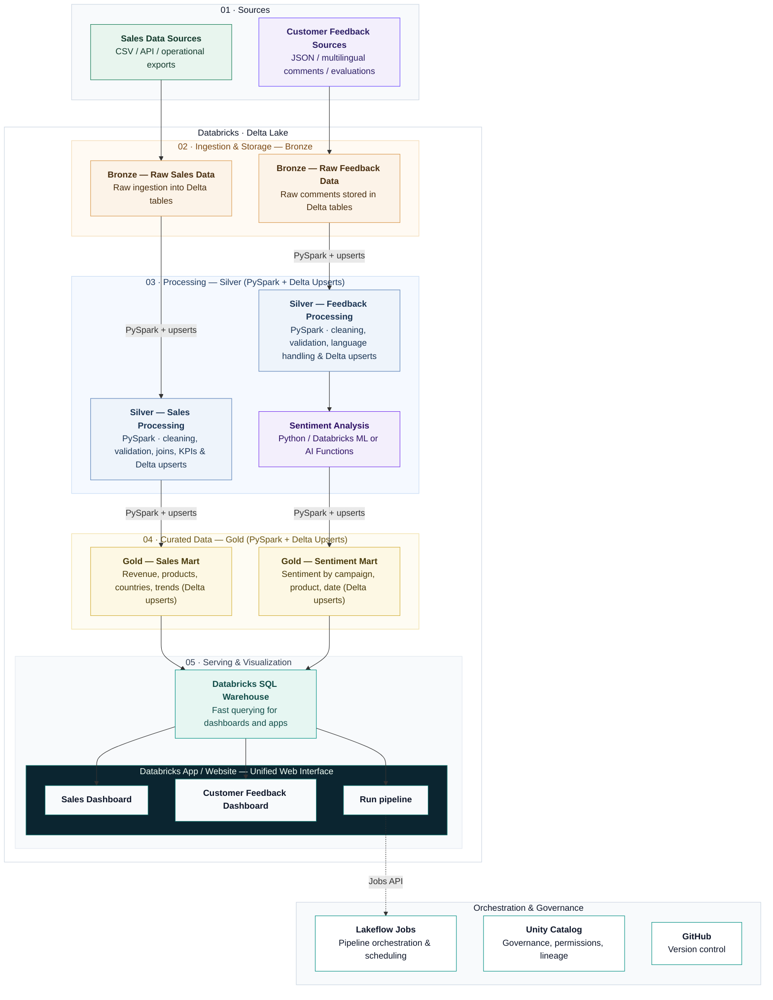

# ASA TECH — KYC360

## Architecture Diagram

```mermaid
flowchart TB
    subgraph SRC["01 · Sources"]
        direction LR
        S["<b>Sales Data Sources</b><br/>CSV / API / operational exports"]
        F["<b>Customer Feedback Sources</b><br/>JSON / multilingual comments / evaluations"]
    end

    subgraph DL["Databricks · Delta Lake"]
        direction TB

        subgraph BRONZE["02 · Ingestion & Storage — Bronze"]
            direction LR
            B_SALES["<b>Bronze — Raw Sales Data</b><br/>Raw ingestion into Delta tables"]
            B_FB["<b>Bronze — Raw Feedback Data</b><br/>Raw comments stored in Delta tables"]
        end

        subgraph SILVER["03 · Processing — Silver (PySpark + Delta Upserts)"]
            direction TB
            S_SALES["<b>Silver — Sales Processing</b><br/>PySpark · cleaning, validation, joins, KPIs & Delta upserts"]
            S_FB["<b>Silver — Feedback Processing</b><br/>PySpark · cleaning, validation, language handling & Delta upserts"]
            SENT["<b>Sentiment Analysis</b><br/>Python / Databricks ML or AI Functions"]
            S_FB --> SENT
        end

        subgraph GOLD["04 · Curated Data — Gold (PySpark + Delta Upserts)"]
            direction LR
            G_SALES["<b>Gold — Sales Mart</b><br/>Revenue, products, countries, trends (Delta upserts)"]
            G_FB["<b>Gold — Sentiment Mart</b><br/>Sentiment by campaign, product, date (Delta upserts)"]
        end

        subgraph SERVING["05 · Serving & Visualization"]
            direction TB
            SQL_WH["<b>Databricks SQL Warehouse</b><br/>Fast querying for dashboards and apps"]
            subgraph APP["Databricks App / Website — Unified Web Interface"]
                direction LR
                UI_SALES["<b>Sales Dashboard</b>"]
                UI_FB["<b>Customer Feedback Dashboard</b>"]
                UI_PIPE["<b>Run pipeline</b>"]
            end
            SQL_WH --> UI_SALES
            SQL_WH --> UI_FB
            SQL_WH --> UI_PIPE
        end

        B_SALES -- "PySpark + upserts" --> S_SALES
        B_FB -- "PySpark + upserts" --> S_FB
        S_SALES -- "PySpark + upserts" --> G_SALES
        SENT -- "PySpark + upserts" --> G_FB
        G_SALES --> SQL_WH
        G_FB --> SQL_WH
    end

    subgraph OPS["Orchestration & Governance"]
        direction LR
        JOBS["<b>Lakeflow Jobs</b><br/>Pipeline orchestration & scheduling"]
        UC["<b>Unity Catalog</b><br/>Governance, permissions, lineage"]
        GH["<b>GitHub</b><br/>Version control"]
    end

    S --> B_SALES
    F --> B_FB
    UI_PIPE -. "Jobs API" .-> JOBS

    classDef sourceSales fill:#e8f5ee,stroke:#1b7f5a,color:#133a2c;
    classDef sourceFb fill:#f3effc,stroke:#6d4aff,color:#2d1f66;
    classDef bronze fill:#fcf3e8,stroke:#d99b52,color:#4a2f10;
    classDef silver fill:#eef4fb,stroke:#5b82b8,color:#1b3554;
    classDef sentiment fill:#f3effc,stroke:#7c3aed,color:#2e1065;
    classDef gold fill:#fdf8e4,stroke:#d4b13f,color:#4a3b0c;
    classDef warehouse fill:#e6f6f2,stroke:#0d9488,color:#134e4a;
    classDef appCard fill:#f8fafc,stroke:#0f766e,color:#0f172a;
    classDef ops fill:#ffffff,stroke:#0d9488,color:#0f172a;

    class S sourceSales;
    class F sourceFb;
    class B_SALES,B_FB bronze;
    class S_SALES,S_FB silver;
    class SENT sentiment;
    class G_SALES,G_FB gold;
    class SQL_WH warehouse;
    class UI_SALES,UI_FB,UI_PIPE appCard;
    class JOBS,UC,GH ops;

    style SRC fill:#f8fafc,stroke:#cbd5e1,color:#0f172a
    style DL fill:#ffffff,stroke:#cbd5e1,color:#0f172a
    style BRONZE fill:#fffaf3,stroke:#f3d9b1,color:#7c4a15
    style SILVER fill:#f5f9ff,stroke:#c7dbf4,color:#1e3a5f
    style GOLD fill:#fefcf3,stroke:#f0dfa0,color:#6b5412
    style SERVING fill:#f8fafc,stroke:#e2e8f0,color:#334155
    style APP fill:#0b2530,stroke:#0f766e,color:#f0fdf4
    style OPS fill:#f8fafc,stroke:#cbd5e1,color:#0f172a
```

## Documentation

- [Bronze Layer — Customer Feedback Ingestion](documentation/bronze-layer.md)
