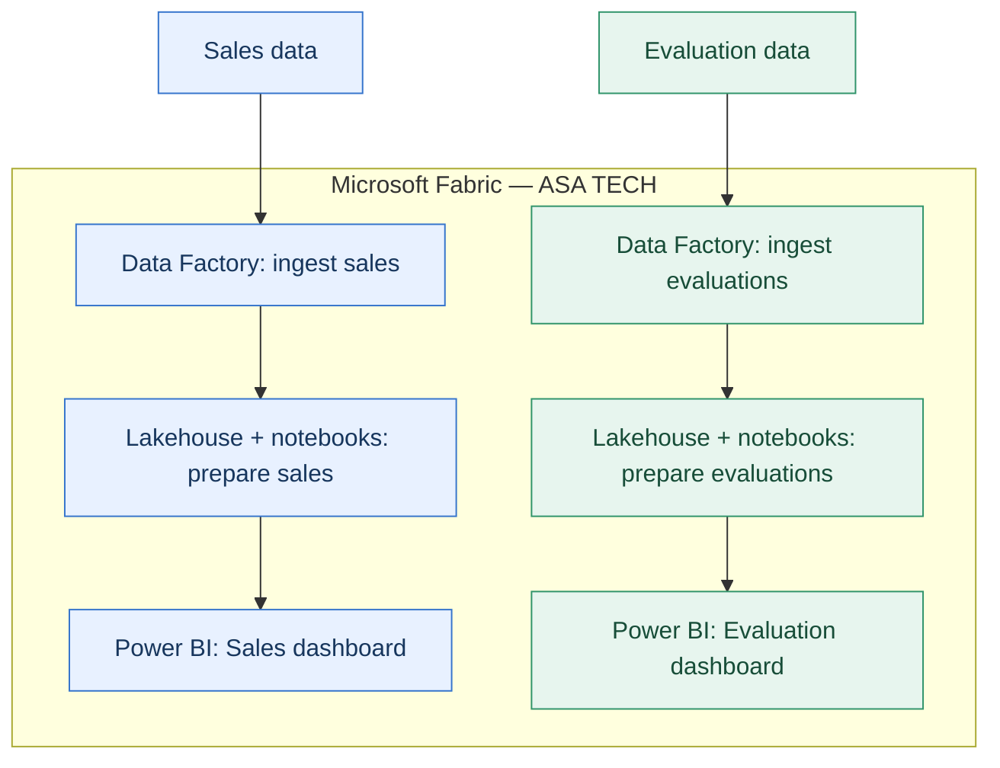

# ASA TECH — KYC 360

## Architecture Diagram

```mermaid
flowchart TB
    S["Sales data"] --> SI["Data Factory: ingest sales"]
    E["Evaluation data"] --> EI["Data Factory: ingest evaluations"]

    subgraph F["Microsoft Fabric — ASA TECH"]
        SI --> SP["Lakehouse + notebooks: prepare sales"]
        EI --> EP["Lakehouse + notebooks: prepare evaluations"]
        SP --> SD["Power BI: Sales dashboard"]
        EP --> ED["Power BI: Evaluation dashboard"]
    end

    classDef sales fill:#e8f1ff,stroke:#3675cc,color:#17365d;
    classDef evaluation fill:#e7f5ee,stroke:#31946b,color:#174d38;
    class S,SI,SP,SD sales;
    class E,EI,EP,ED evaluation;
```
