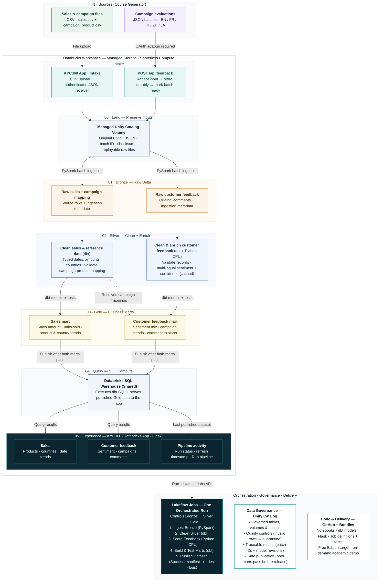

# ASA TECH — KYC360

## Architecture Diagram

```mermaid
flowchart TB
    subgraph SRC["IN · Sources (Course Generator)"]
        direction LR
        S["<b>Sales & campaign files</b><br/>CSV · sales.csv + campaign_product.csv"]
        F["<b>Campaign evaluations</b><br/>JSON batches · EN / FR / HI / ZH / JA"]
    end

    subgraph WS["Databricks Workspace — Managed Storage · Serverless Compute"]
        direction TB

        subgraph INTAKE["Intake"]
            direction LR
            APP_IN["<b>KYC360 App · Intake</b><br/>CSV upload + authenticated JSON receiver"]
            API_IN["<b>POST /api/feedback</b><br/>Accept input → store durably → mark batch ready"]
        end

        subgraph LAND["00 · Land — Preserve Inputs"]
            VOL["<b>Managed Unity Catalog Volume</b><br/>Original CSV + JSON · batch ID · checksum · replayable raw files"]
        end

        subgraph BRONZE["01 · Bronze — Raw Delta"]
            direction LR
            B_SALES["<b>Raw sales + campaign mapping</b><br/>Source rows + ingestion metadata"]
            B_FB["<b>Raw customer feedback</b><br/>Original comments + ingestion metadata"]
        end

        subgraph SILVER["02 · Silver — Clean + Enrich"]
            direction LR
            S_SALES["<b>Clean sales & reference data</b> (dbt)<br/>Typed dates, amounts, countries · validate campaign-product mapping"]
            S_FB["<b>Clean & enrich customer feedback</b> (dbt + Python CPU)<br/>Validate records · multilingual sentiment + confidence (cached)"]
        end

        subgraph GOLD["03 · Gold — Business Marts"]
            direction LR
            G_SALES["<b>Sales mart</b><br/>Sales amount · units sold · product & country trends"]
            G_FB["<b>Customer feedback mart</b><br/>Sentiment mix · campaign trends · comment explorer"]
        end

        subgraph QUERY["04 · Query — SQL Compute"]
            SQL_WH["<b>Databricks SQL Warehouse (Shared)</b><br/>Executes dbt SQL + serves published Gold data to the app"]
        end

        subgraph EXP["05 · Experience — KYC360 (Databricks App · Flask)"]
            direction LR
            UI_SALES["<b>Sales</b><br/>Products · countries · date trends"]
            UI_FB["<b>Customer feedback</b><br/>Sentiment · campaigns · comments"]
            UI_PIPE["<b>Pipeline activity</b><br/>Run status · refresh timestamp · Run pipeline"]
        end

        APP_IN --> VOL
        API_IN --> VOL
        VOL -- "PySpark batch ingestion" --> B_SALES
        VOL -- "PySpark batch ingestion" --> B_FB
        B_SALES --> S_SALES
        B_FB --> S_FB
        S_SALES -- "dbt models + tests" --> G_SALES
        S_FB -- "dbt models + tests" --> G_FB
        S_SALES -. "Resolved campaign mappings" .-> G_FB
        G_SALES -- "Publish after both marts pass" --> SQL_WH
        G_FB -- "Publish after both marts pass" --> SQL_WH
        SQL_WH -- "Query results" --> UI_SALES
        SQL_WH -- "Query results" --> UI_FB
        SQL_WH -- "Last published dataset" --> UI_PIPE
    end

    subgraph OPS["Orchestration · Governance · Delivery"]
        direction LR
        JOBS["<b>Lakeflow Jobs — One Orchestrated Run</b><br/>Controls Bronze → Silver → Gold<br/>1. Ingest Bronze (PySpark)<br/>2. Clean Silver (dbt)<br/>3. Score Feedback (Python · CPU)<br/>4. Build & Test Marts (dbt)<br/>5. Publish Dataset (Success manifest · retries · logs)"]
        GOV["<b>Data Governance — Unity Catalog</b><br/>• Governed tables, volumes & access<br/>• Quality controls (invalid rows → quarantine)<br/>• Traceable results (batch IDs + model revisions)<br/>• Safe publication (both marts pass before release)"]
        DELIVERY["<b>Code & Delivery — GitHub + Bundles</b><br/>Notebooks · dbt models · Flask · Job definitions + tests<br/>Free Edition target · on-demand academic demo"]
    end

    S -- "File upload" --> APP_IN
    F -- "OAuth adapter required" --> API_IN
    UI_PIPE -. "Run + status · Jobs API" .-> JOBS

    classDef sourceSales fill:#e8f5ee,stroke:#1b7f5a,color:#133a2c;
    classDef sourceFb fill:#f3effc,stroke:#6d4aff,color:#2d1f66;
    classDef intake fill:#e6f6f2,stroke:#0d9488,color:#134e4a;
    classDef land fill:#f1f5f9,stroke:#64748b,color:#1e293b;
    classDef bronze fill:#fcf3e8,stroke:#d99b52,color:#4a2f10;
    classDef silver fill:#eef4fb,stroke:#5b82b8,color:#1b3554;
    classDef gold fill:#fdf8e4,stroke:#d4b13f,color:#4a3b0c;
    classDef query fill:#f1f5f9,stroke:#475569,color:#0f172a;
    classDef app fill:#0b2530,stroke:#0f766e,color:#f0fdf4;
    classDef jobs fill:#0b2530,stroke:#14b8a6,color:#f0fdf4;
    classDef gov fill:#ffffff,stroke:#0d9488,color:#0f172a;

    class S sourceSales;
    class F sourceFb;
    class APP_IN,API_IN intake;
    class VOL land;
    class B_SALES,B_FB bronze;
    class S_SALES,S_FB silver;
    class G_SALES,G_FB gold;
    class SQL_WH query;
    class UI_SALES,UI_FB,UI_PIPE app;
    class JOBS jobs;
    class GOV,DELIVERY gov;

    style SRC fill:#f8fafc,stroke:#cbd5e1,color:#0f172a
    style WS fill:#ffffff,stroke:#cbd5e1,color:#0f172a
    style INTAKE fill:#f8fafc,stroke:#e2e8f0,color:#334155
    style LAND fill:#f8fafc,stroke:#e2e8f0,color:#334155
    style BRONZE fill:#fffaf3,stroke:#f3d9b1,color:#7c4a15
    style SILVER fill:#f5f9ff,stroke:#c7dbf4,color:#1e3a5f
    style GOLD fill:#fefcf3,stroke:#f0dfa0,color:#6b5412
    style QUERY fill:#f8fafc,stroke:#e2e8f0,color:#334155
    style EXP fill:#0f2d38,stroke:#0f766e,color:#f0fdf4
    style OPS fill:#f8fafc,stroke:#cbd5e1,color:#0f172a
```
